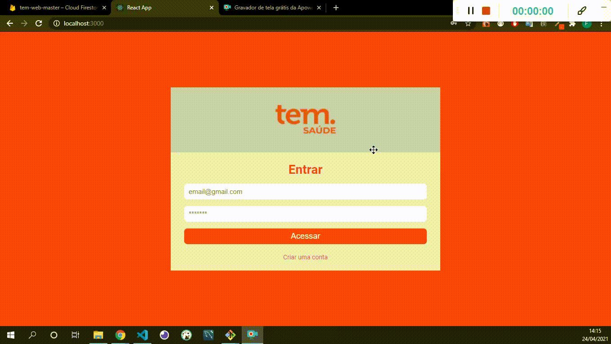

<h1 align="center">
    
  <br>
</h1>


## 🚀 Projeto

Desafio da tem saude. 

## Testando a aplicação

Caso queira testar a aplicação em produção segue o link abaixo
link -> https://tem-web-master.web.app/


## 💻 Como utilizar

### Faça o clone do repositório
```bash
# Digite o comando abaixo para clonar o repositório
$ git clone https://github.com/fabricioig863/tem-web-master
```

### Iniciando o Projeto

```bash
# Vá para o repositório do projeto
$ cd tem-web-master

# Instale as dependencias
$ yarn

# Para iniciar o servidor
$ yarn start
```

## 💻 Tecnologias

- React

Feito com ❣️ por Fabricio Ignacio de Espindola